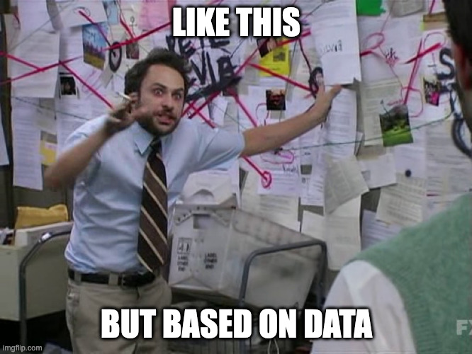

# Goal

Let's learn more about our institution while learning more about javascript and interactive information visualization (a.k.a. "infovis" or "dataviz").

# Plan
## Get your own copy of the code and run it
1. Fork this repository
1. Clone your fork

## Getting started with an npm project

Note: this not about using 3p code in your own app (final project)

1. come to have the code (e.g. clone repo, as in preceding section)
1. open a terminal in that directory (i.e. the one that has the `package.json` file), you will know this worked because you will see the `package.json` file when you run `ls` or `dir`
1. run `npm i` (or `npm install` to install the dependencies listed in the `package.json` file)
1. you're ready to roll, so in the case of this project which is built with vite, you could now do like `npm run dev`

## What does the starter code do?
1. Go to the URL listed in the output of the previous step (e.g. http://localhost:5173/ )
1. What do you see?
1. Review the `index.html` and `main.js` files to see what they're doing
    * Notice that `main.js`:
        1. loads the `d3` library: https://d3js.org/what-is-d3
        1. fetches some json data from `data/data_sankey.json`
            * take a look at this file: 
                1. what javascript data structures are used in this file?
                1. what general data structure (for those of you have taken Dat Structures) might best represent the data that is in this file?
        1. uses the `d3-sankey` library to create a sankey diagram

## Make a Sankey using our own data

We will make 4 Sankey diagrams (more details follow) using data from JMU which you can find in the `data` directory.
1. Inspect the `data/jmu.json` file
    * What javascript structure(s) is(are) used in this file?
    * how does the structure of the data in this file compare to the structure of the data in `data/data_sankey.json`?
1. Create the new sankey diagram per specs below.

### 🤠 Data Wranglin' 
1. When working conducting data analysis, including infovis, it is often necessary to wrangle the data into a format that is more amenable to the task at hand.
    * often this just means in to a format expected by our own existing code, our (or third-party, a.k.a. "3p") libraries, tools, apps, etc.
1. In this case, we will need to wrangle the data in `data/jmu.json` into a format that is expected by the `d3-sankey` library.
1. In `main.js` edit the code where the current json data is loaded to instead load the correct data file, and before proceeding to the next parts of the code, construct data in the format expected by the `d3-sankey` library.

### Sankey 1: JMU Student Costs
1. leftmost node: JMU Student
1. second-to-leftmost nodes: Fall, Spring
1. rightmost nodes: the `student itemized` costs from the `student-costs`

### Sankey 2: JMU Student Auxiliary Comprehensive Fee
1. leftmost node: Auxiliary Comprehensive Fee (or "Comprehensive Fee")
1. rightmost nodes: the `Auxiliary Comprehensive Fee Component` costs from the `student-costs`

### Sankey 3: JMU Revenues
1. leftmost nodes: JMU (positive) Revenue items
1. second-to-leftmost nodes: JMU Revenue Categories (e.g. operating revenues, non-operating revenues, etc.)
1. center node: JMU 
1. second-to-rightmost nodes: JMU Expense (negative revenue) Categories (e.g. operating expenses)
1. rightmost nodes: JMU Expense items (e.g. Instruction, Research, etc.)

### Sankey 4: JMU Athletics Revenues

1. leftmost nodes: football, men's basketball, women's basketball, other sports, non-program specific
1. second-to-leftmost nodes: JMU Athletics (positive) Revenue items (e.g. Ticket sales, etc.)
1. center node: JMU Athletics
1. second-to-rightmost nodes: JMU Athletics Expense categories (negative revenue) (e.g. Athletic student aid, etc.)
1. rightmost nodes: football, men's basketball, women's basketball, other sports, non-program specific

# References

## Topics
1. https://d3-graph-gallery.com/graph/sankey_basic.html
1. https://github.com/d3/d3-sankey
1. https://observablehq.com/@d3/sankey/2
1. https://observablehq.com/@d3/sankey-component

## Data
1. [Undergraduate student estimated annual costs](https://www.jmu.edu/ubo/tuition-and-fees/examples.shtml#undefined)
1. [University Financials](https://dlas-directus-prod.azurewebsites.net/assets/D483491A-F567-42B7-B936-17D1ACF64E9A.pdf)
1. [JMU Athletics Financials](https://dlas-directus-prod.azurewebsites.net/assets/F1F30B26-FCE4-45EE-9222-50D42E8A5C7A.pdf)
1. [(Auxiliary) Comprehensive Fee breakdown](https://www.jmu.edu/ubo/student-accounts/rates-breakdown.shtml)
1. [The Breeze -- Over $900 for debt, $444 for UREC: Exclusive breakdown of student fees](https://www.breezejmu.org/news/over-900-for-debt-444-for-urec-exclusive-breakdown-of-student-fees/article_b98cc294-0f44-11ef-a311-c75b454e3750.html)
    * [Auxiliary Comprehensive Fee Expenditure Breakdown for FY 24](https://bloximages.newyork1.vip.townnews.com/breezejmu.org/content/tncms/assets/v3/editorial/b/a5/ba5940ac-0f4a-11ef-aa66-eb7bb38401ee/663eed2533491.pdf.pdf)

# Acknowledgements
1. https://www.data-to-viz.com/
